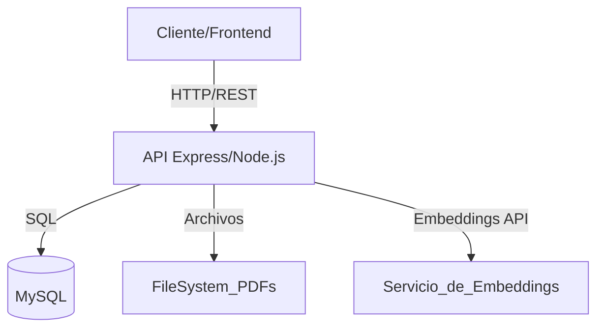
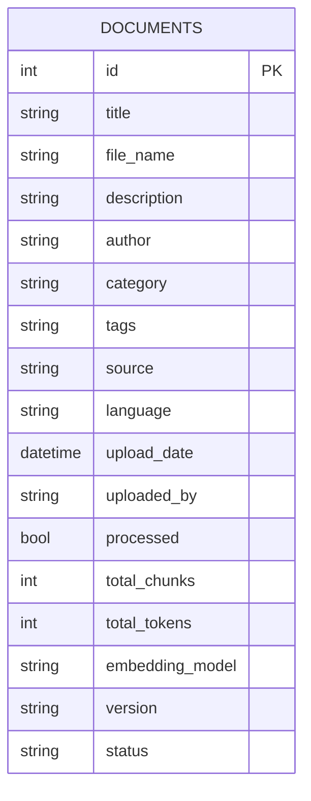
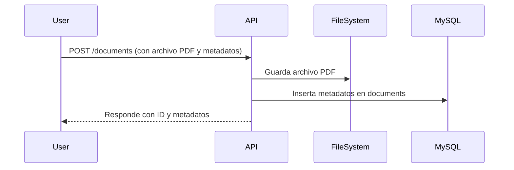
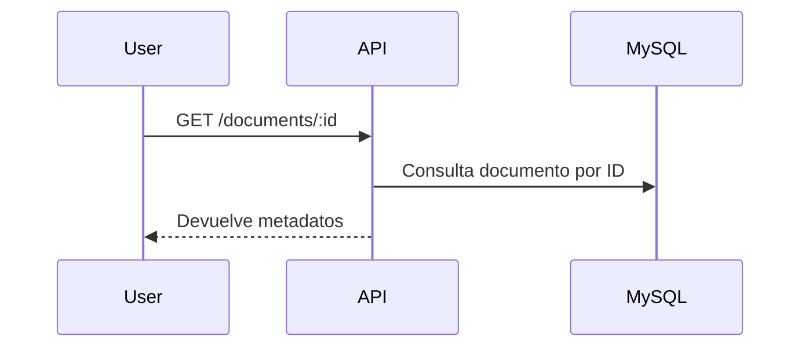
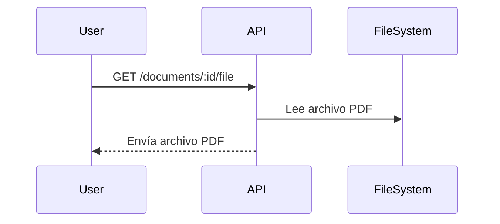

# RAGInternos - Documentación Técnica y Arquitectónica

## Tabla de Contenidos

- [Visión General](#visión-general)
- [Arquitectura General](#arquitectura-general)
- [Componentes Principales](#componentes-principales)
- [Modelo de Datos](#modelo-de-datos)
- [Flujos de Procesos](#flujos-de-procesos)
- [Integraciones y Dependencias](#integraciones-y-dependencias)
- [Consideraciones de Seguridad](#consideraciones-de-seguridad)
- [Escalabilidad y Mantenimiento](#escalabilidad-y-mantenimiento)
- [Diagramas Mermaid](#diagramas-mermaid)
- [Glosario](#glosario)

---

## Visión General

RAGInternos es una API orientada a la gestión, procesamiento y consulta de documentos, con enfoque en la integración de técnicas de Recuperación Aumentada por Generación (RAG). El sistema permite almacenar, procesar, consultar y servir documentos, principalmente en formato PDF, y está preparado para integrarse con modelos de embeddings y flujos de procesamiento de lenguaje natural.

---

## Arquitectura General

La arquitectura de RAGInternos es modular y orientada a servicios. Utiliza Node.js y Express para exponer una API REST que gestiona documentos y metadatos almacenados en MySQL. Los archivos PDF se guardan en el sistema de archivos local. El sistema está preparado para integrarse con servicios de embeddings para procesamiento semántico, y cada componente tiene responsabilidades claras para facilitar la escalabilidad y el mantenimiento.

El sistema sigue una arquitectura modular basada en servicios, donde cada módulo se encarga de una responsabilidad específica (gestión de documentos, procesamiento, almacenamiento, etc.). Utiliza Node.js como backend, Express para la gestión de rutas HTTP y MySQL como base de datos principal.

---

## Componentes Principales

### 1. API Express

- Gestiona rutas para CRUD de documentos.
- Expone endpoints para subir, consultar, modificar y eliminar documentos.
- Sirve archivos PDF almacenados en el sistema de archivos.

### 2. Servicio de Documentos (`documentService.js`)

- Lógica de negocio para manipulación de documentos.
- Interacción con la base de datos y el sistema de archivos.
- Serialización/deserialización de metadatos y tags.

### 3. Base de Datos MySQL

- Almacena metadatos de documentos.
- Estructura flexible para soportar tags, versiones y modelos de embeddings.

### 4. Sistema de Archivos

- Almacena los archivos PDF subidos.
- Integrado con la API para servir archivos bajo demanda.

### 5. Servicio de Embeddings (Integración)

- Preparado para interactuar con modelos de embeddings (ej. OpenAI, local).
- Almacena información sobre el modelo usado y los tokens generados.

---

## Modelo de Datos

La tabla principal es `documents`, que contiene los siguientes campos clave:

- `id`: Identificador único.
- `title`, `file_name`, `description`, `author`, `category`
- `tags`: Array serializado en JSON.
- `source`, `language`, `upload_date`, `uploaded_by`
- `processed`, `total_chunks`, `total_tokens`
- `embedding_model`, `version`, `status`

---

## Flujos de Procesos

### 1. Subida de Documento

### 2. Consulta de Documento

### 3. Descarga de PDF

---

## Integraciones y Dependencias

- **Node.js**: Entorno de ejecución principal.
- **Express**: Framework para la API REST.
- **MySQL**: Base de datos relacional.
- **fs, path**: Módulos nativos para manejo de archivos.
- **Servicios de Embeddings**: Integración opcional para procesamiento semántico.

---

## Consideraciones de Seguridad

- Validación de existencia de archivos antes de servirlos.
- Serialización segura de campos como `tags`.
- Uso de parámetros preparados en SQL para evitar inyección.
- Control de acceso y autenticación (a implementar según necesidades).

---

## Escalabilidad y Mantenimiento

- Separación de lógica de negocio y acceso a datos.
- Preparado para integración con servicios externos (embeddings, almacenamiento en la nube).
- Modularidad para facilitar pruebas y mantenimiento.
- Uso de paginación en consultas para evitar sobrecarga.

---

## Diagramas Mermaid

### Arquitectura General

### Modelo de Datos

### Flujo de Subida de Documento

---

## Glosario

- **RAG**: Recuperación Aumentada por Generación.
- **Embeddings**: Representaciones vectoriales de texto para búsqueda semántica.
- **CRUD**: Operaciones de Crear, Leer, Actualizar y Eliminar.
- **API REST**: Interfaz de programación de aplicaciones basada en HTTP.

---

> _Este documento debe mantenerse actualizado conforme evolucione la arquitectura y los componentes del sistema._
