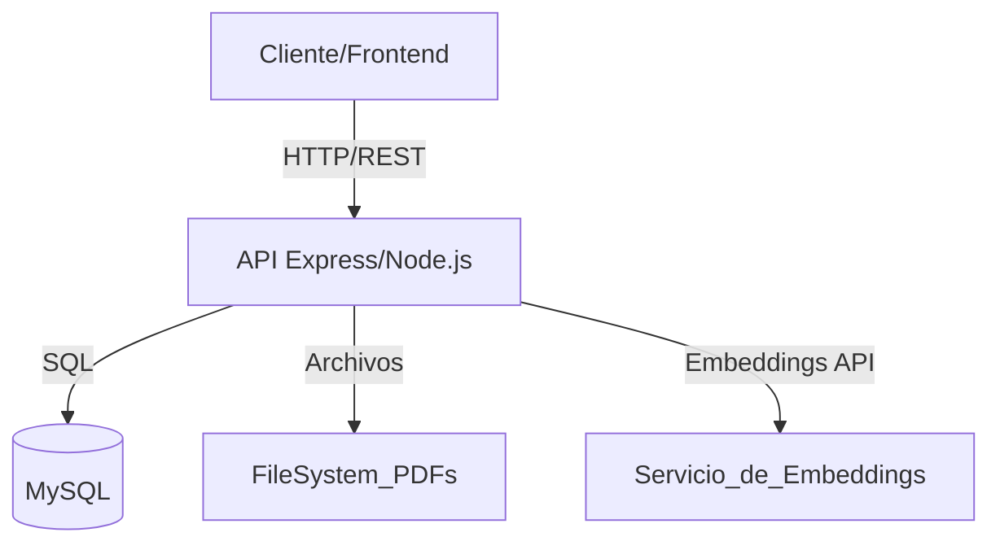
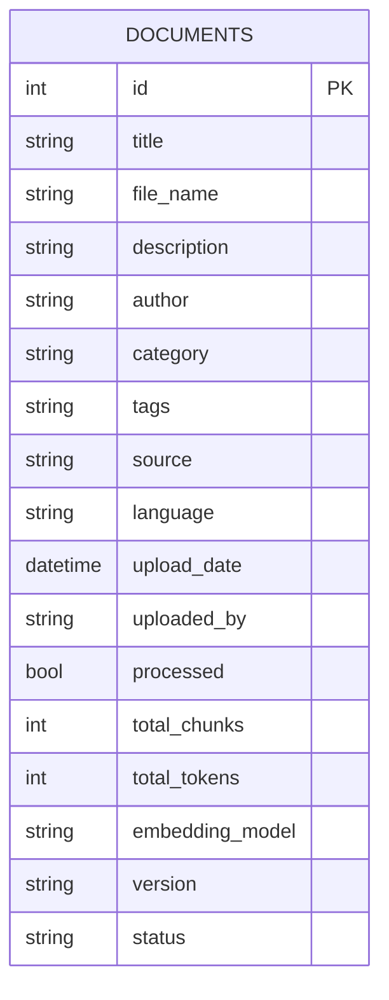
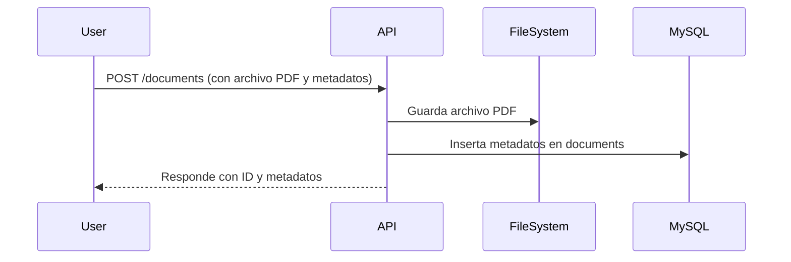
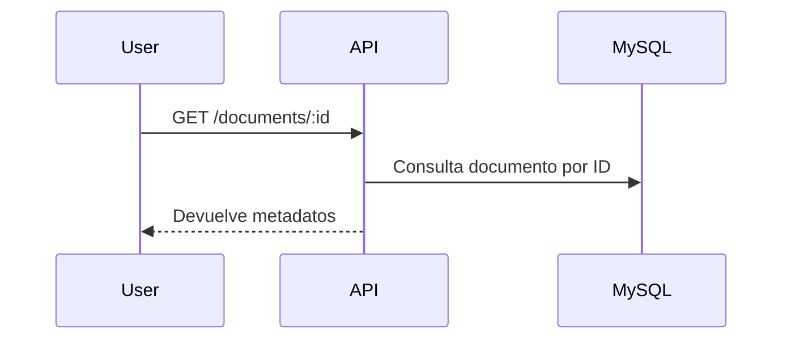
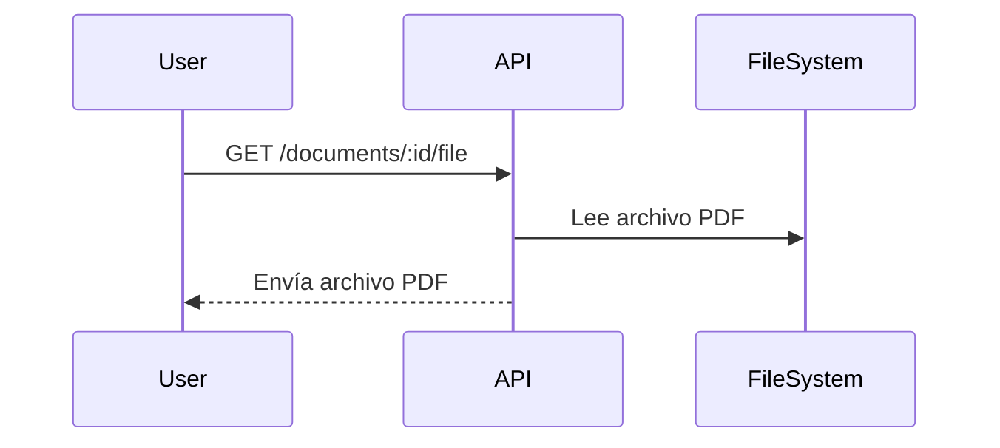

# rag-api
## Tabla de Contenidos

- [Visión General](#visión-general)
- [Arquitectura General](#arquitectura-general)
- [Componentes Principales](#componentes-principales)
- [Modelo de Datos](#modelo-de-datos)
- [Flujos de Procesos](#flujos-de-procesos)
- [Integraciones y Dependencias](#integraciones-y-dependencias)
- [Consideraciones de Seguridad](#consideraciones-de-seguridad)
- [Escalabilidad y Mantenimiento](#escalabilidad-y-mantenimiento)
- [Diagramas Mermaid](#diagramas-mermaid)
- [Glosario](#glosario)

---

## Project Overview
This project is a RESTful API designed to handle embedding functionalities and querying operations. It provides endpoints for processing and managing data, particularly focusing on embeddings and PDF file handling.

## File Structure
La estructura del proyecto es la siguiente:

```
rag-api/
├── .env                      # Variables de entorno de la aplicación
├── app.js                    # Punto de entrada principal de la aplicación
├── routes/                   # Definición de rutas de la API
│   ├── documents.js              # Rutas para gestión de documentos
│   ├── documentChunks.js         # Rutas para gestión de fragmentos/chunks de documentos
│   ├── embed.js                  # Rutas para procesamiento y subida de embeddings/PDF
│   ├── query.js                  # Rutas para consultas semánticas y gestión de colecciones
│   └── index.js                  # (Opcional) Archivo para centralizar y exportar rutas
├── services/                 # Lógica de negocio y acceso a datos
│   ├── rag/
│   │   ├── chromaService.js         # Interacción con ChromaDB
│   │   ├── documentService.js       # Lógica de documentos y base de datos
│   │   ├── documentChunkService.js  # Lógica para gestión de fragmentos/chunks de documentos
│   │   ├── embeddingService.js      # Procesamiento y almacenamiento de embeddings
│   ├── pdfService.js                # Procesamiento de archivos PDF (fuera de rag/)
│   └── mysqlService.js              # Servicio de conexión y utilidades para MySQL
├── utils/                    # Funciones utilitarias
│   └── chunker.js                # Fragmentación de texto en chunks
├── data/                     # Almacenamiento de datos
│   └── uploads/                  # Archivos PDF subidos por los usuarios
├── docs/                     # Documentación técnica y de endpoints
│   └── query.md                  # Documentación de las rutas de consulta semántica
│   └── documents.md          # Documentación de las rutas y lógica de gestión de documentos
│   └── embed.md              # Documentación de las rutas y lógica de embeddings
│   └── documentChunks.md     # Documentación de la gestión de fragmentos/chunks de documentos
├── embeddings.json           # Almacenamiento temporal de embeddings
├── package.json              # Configuración de npm y dependencias
└── README.md                 # Documentación principal del proyecto
```

## Setup Instructions
1. Clone the repository to your local machine.
2. Navigate to the project directory.
3. Create a `.env` file and populate it with the necessary environment variables.
4. Run `npm install` to install the required dependencies.
5. Start the application using `node app.js`.

## Usage Guidelines
- Use the `/embed` route to handle embedding requests.
- Use the `/query` route to perform queries on the data.
- Uploaded PDF files should be placed in the `data/uploads` directory.

## Contributing
Contributions are welcome! Please submit a pull request or open an issue for any enhancements or bug fixes.

# RAG API – OpenAI + ChromaDB

API REST en Node.js para procesar documentos PDF, generar embeddings con OpenAI y realizar búsquedas semánticas usando ChromaDB.

## 🚀 Funcionalidades

- 📄 Carga de PDF y fragmentación por tokens (precisión real con tiktoken)
- 🧠 Generación de embeddings con OpenAI
- 🗃️ Almacenamiento en ChromaDB con metadatos
- 🔍 Búsqueda semántica por lenguaje natural (consultas con contexto)

## 📦 Requisitos

- Node.js 18+
- Docker (para ChromaDB)
- Clave de API de OpenAI

## 🔧 Instalación

```bash
git clone https://github.com/jcpazmino/rag-api.git
cd rag-api
npm install
cp .env.example .env
# Edita .env con tu API key de OpenAI
```

### 🚢 Ejecutar ChromaDB

```bash
docker run -d -p 8000:8000 ghcr.io/chroma-core/chroma:latest
```

## 🧪 Endpoints

### POST `/embed-pdf`

Carga un PDF, lo fragmenta, genera embeddings y los guarda en Chroma.

**Body (form-data):**
- `pdf`: archivo PDF

**Respuesta:**
```json
{
  "message": "✅ 20 fragmentos procesados y almacenados en Chroma."
}
```

---

### POST `/query`

Envía una pregunta y recibe los fragmentos más relevantes del PDF.

**Body (JSON):**
```json
{
  "pregunta": "¿Cuáles son los principios del currículo?"
}
```

**Respuesta:**
```json
{
  "pregunta": "...",
  "resultados": [
    { "texto": "...", "score": 0.13 },
    ...
  ]
}
```

---

## 📁 Estructura del proyecto

```
rag-api/
├── routes/
├── services/
├── utils/
├── data/uploads/
├── .env
├── app.js
└── package.json
```

---

## 🧠 Stack

- Express.js
- OpenAI Embeddings
- ChromaDB (REST)
- pdf-parse + tiktoken

---

## 📜 Licencia

MIT

## Databases Used

This application uses two main databases:

1. **ChromaDB**  
   - Vector database for storing and querying embeddings and metadata of document fragments.
   - Accessed via its REST API (default: `http://localhost:8000`).
   - Used for semantic search and context retrieval.

2. **MySQL**  
   - Relational database for storing structured information about documents and their fragments (tables like `documents` and `document_chunks`).
   - Accessed via the `mysql2` client from Node.js.
   - Used for administration, querying, and management of documents and their structured metadata.

**Summary:**  
The app uses **ChromaDB** for embeddings and semantic search, and **MySQL** for structured document and fragment management.

## ChromaDB Setup

The command to create and run a ChromaDB container using Docker is:

```sh
docker run -d -p 8000:8000 ghcr.io/chroma-core/chroma:latest
```

By default, the ChromaDB REST API will be available at `http://localhost:8000`.

**Database name used in ChromaDB:**  
The application uses the database named:

```
rag_api
```

This is set via the environment variable `CHROMA_DATABASE=rag_api` in your `.env` file.
**To create the database in PowerShell:**
```powershell
curl -Method POST http://localhost:8000/api/v2/tenants/default_tenant/databases `
  -Headers @{"Content-Type"="application/json"} `
  -Body '{"name": "rag_api"}'
```

**To validate if the database exists:**
```powershell
curl http://localhost:8000/api/v2/tenants/default_tenant/databases
```

## Reiniciar la colección en ChromaDB

Para reiniciar la colección `documentos_rag` (eliminarla y crearla de nuevo) usando el endpoint expuesto por la API, ejecuta el siguiente comando desde la terminal:

```powershell
curl -X POST http://localhost:3000/query/reiniciar-coleccion
```
```terminal
curl.exe -X POST http://localhost:3000/query/reiniciar-coleccion
```

Asegúrate de que tu API esté corriendo y que el puerto (`3000`) corresponda al configurado en tu aplicación.

## MySQL Setup

The command to create and run a MySQL container using Docker is:

```sh
docker run --name mysql-RAG -e MYSQL_ROOT_PASSWORD=1234 -e MYSQL_DATABASE=ragdb -p 3306:3306 -d mysql:8
```

- `--name mysql-RAG` → container name
- `-e MYSQL_ROOT_PASSWORD=1234` → root user password
- `-e MYSQL_DATABASE=ragdb` → database name to be created automatically
- `-p 3306:3306` → exposes port 3306 for external connections
- `-d mysql:8` → uses the official MySQL version 8 image

This will start a MySQL container accessible at `localhost:3306` with the database `ragdb` and password `1234`.

El comando para iniciar la app es:
```sh
node app.js
```

# RAGInternos - Documentación Técnica y Arquitectónica


## Visión General

RAGInternos es una API orientada a la gestión, procesamiento y consulta de documentos, con enfoque en la integración de técnicas de Recuperación Aumentada por Generación (RAG). El sistema permite almacenar, procesar, consultar y servir documentos, principalmente en formato PDF, y está preparado para integrarse con modelos de embeddings y flujos de procesamiento de lenguaje natural.

---

## Arquitectura General

La arquitectura de RAGInternos es modular y orientada a servicios. Utiliza Node.js y Express para exponer una API REST que gestiona documentos y metadatos almacenados en MySQL. Los archivos PDF se guardan en el sistema de archivos local. El sistema está preparado para integrarse con servicios de embeddings para procesamiento semántico, y cada componente tiene responsabilidades claras para facilitar la escalabilidad y el mantenimiento.

El sistema sigue una arquitectura modular basada en servicios, donde cada módulo se encarga de una responsabilidad específica (gestión de documentos, procesamiento, almacenamiento, etc.). Utiliza Node.js como backend, Express para la gestión de rutas HTTP y MySQL como base de datos principal.



---

## Componentes Principales

### 1. API Express

- Gestiona rutas para CRUD de documentos.
- Expone endpoints para subir, consultar, modificar y eliminar documentos.
- Sirve archivos PDF almacenados en el sistema de archivos.

### 2. Servicio de Documentos (`documentService.js`)

- Lógica de negocio para manipulación de documentos.
- Interacción con la base de datos y el sistema de archivos.
- Serialización/deserialización de metadatos y tags.

### 3. Base de Datos MySQL

- Almacena metadatos de documentos.
- Estructura flexible para soportar tags, versiones y modelos de embeddings.

### 4. Sistema de Archivos

- Almacena los archivos PDF subidos.
- Integrado con la API para servir archivos bajo demanda.

### 5. Servicio de Embeddings (Integración)

- Preparado para interactuar con modelos de embeddings (ej. OpenAI, local).
- Almacena información sobre el modelo usado y los tokens generados.

---

## Modelo de Datos

La tabla principal es `documents`, que contiene los siguientes campos clave:

- `id`: Identificador único.
- `title`, `file_name`, `description`, `author`, `category`
- `tags`: Array serializado en JSON.
- `source`, `language`, `upload_date`, `uploaded_by`
- `processed`, `total_chunks`, `total_tokens`
- `embedding_model`, `version`, `status`



---

## Flujos de Procesos

### 1. Subida de Documento



### 2. Consulta de Documento



### 3. Descarga de PDF



---

## Integraciones y Dependencias

- **Node.js**: Entorno de ejecución principal.
- **Express**: Framework para la API REST.
- **MySQL**: Base de datos relacional.
- **fs, path**: Módulos nativos para manejo de archivos.
- **Servicios de Embeddings**: Integración opcional para procesamiento semántico.

---

## Consideraciones de Seguridad

- Validación de existencia de archivos antes de servirlos.
- Serialización segura de campos como `tags`.
- Uso de parámetros preparados en SQL para evitar inyección.
- Control de acceso y autenticación (a implementar según necesidades).

---

## Escalabilidad y Mantenimiento

- Separación de lógica de negocio y acceso a datos.
- Preparado para integración con servicios externos (embeddings, almacenamiento en la nube).
- Modularidad para facilitar pruebas y mantenimiento.
- Uso de paginación en consultas para evitar sobrecarga.

---

## Diagramas Mermaid

### Arquitectura General


### Modelo de Datos


### Flujo de Subida de Documento


---

## Glosario

- **RAG**: Recuperación Aumentada por Generación.
- **Embeddings**: Representaciones vectoriales de texto para búsqueda semántica.
- **CRUD**: Operaciones de Crear, Leer, Actualizar y Eliminar.
- **API REST**: Interfaz de programación de aplicaciones basada en HTTP.

---

> _Este documento debe mantenerse actualizado conforme evolucione la arquitectura y los componentes del sistema._