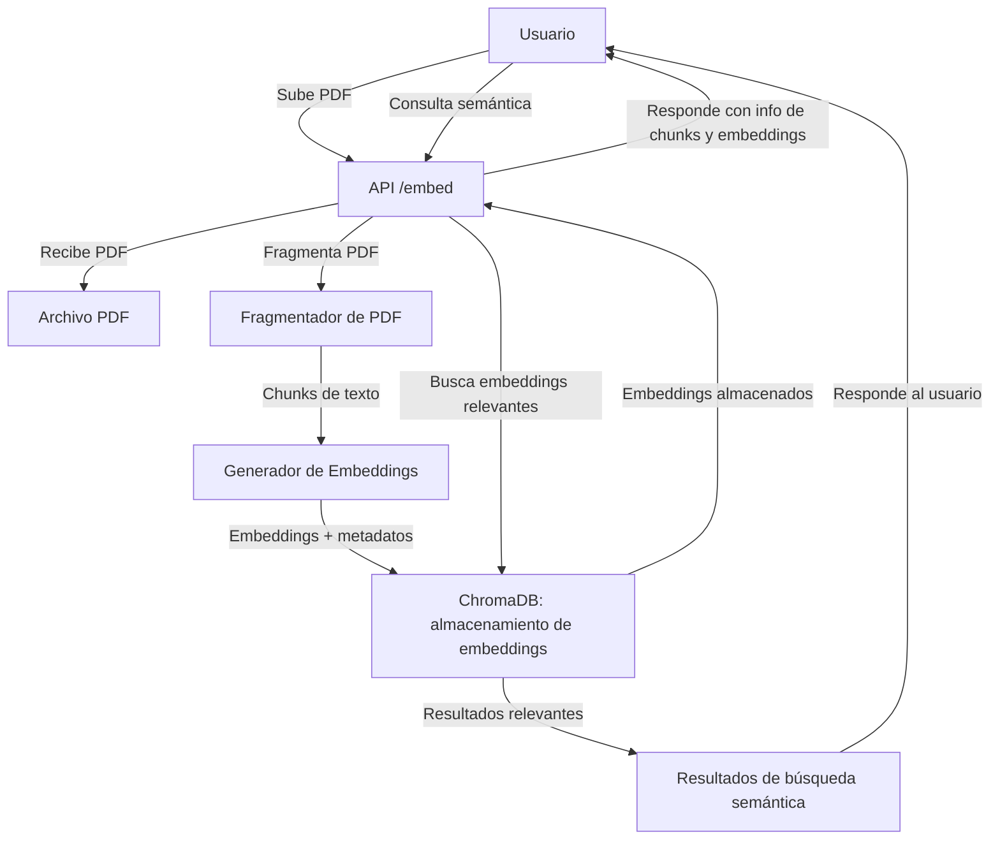
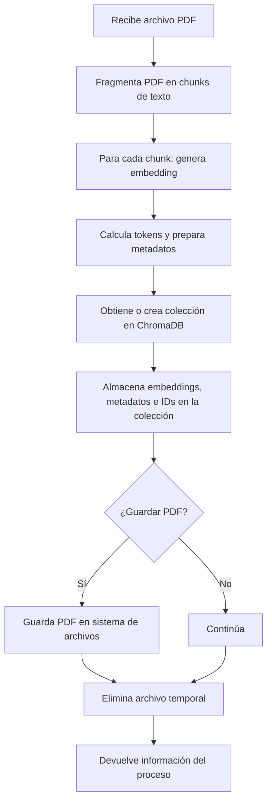

# Documentación Técnica: Rutas y Lógica de Embeddings (`routes/embed.js` y `services/rag/embeddingService.js`)

Este documento describe el funcionamiento de las rutas y la lógica asociada al procesamiento de embeddings en el sistema **RAGInternos**.

---

## Tabla de Contenidos

- [Propósito General](#propósito-general)
- [Endpoints Principales](#endpoints-principales)
  - [POST `/embed/`](#post-embed)
  - [GET `/embed/:id`](#get-embedid)
- [Lógica de Procesamiento (`services/rag/embeddingService.js`)](#lógica-de-procesamiento-servicesragembeddingservicejs)
- [Consideraciones](#consideraciones)
- [Ejemplo de Uso](#ejemplo-de-uso)

---

## Propósito General

El módulo de embeddings permite recibir archivos PDF, procesarlos para extraer fragmentos (chunks) y generar sus representaciones vectoriales (embeddings). Estos embeddings se almacenan y se utilizan para búsquedas semánticas y recuperación aumentada por generación (RAG).



---

[Volver a la tabla de contenidos](#tabla-de-contenidos)

## Endpoints Principales

### POST `/embed/`

- **Descripción:**  
  Recibe un archivo PDF, lo procesa y genera los embeddings de sus fragmentos.
- **Parámetros:**  
  - `pdf` (archivo, requerido): Archivo PDF enviado en el cuerpo de la petición (formato `multipart/form-data`).
- **Flujo:**
  1. Valida que se haya subido un archivo.
  2. Llama a la función `createEmbedding` del servicio.
  3. Devuelve información sobre los chunks y el proceso realizado.

- **Respuesta exitosa:**
  ```json
  {
    "totalChunks": "12",
    "totalTokens": 3456,
    "newFileName": "uuid_o_nombre_coleccion"
  }
  ```

---

### GET `/embed/:id`

- **Descripción:**  
  Recupera un embedding por su identificador.
- **Parámetros:**  
  - `id` (string, requerido): Identificador del embedding.
- **Flujo:**
  1. Busca el embedding por ID.
  2. Si no existe, responde con 404.
  3. Si existe, devuelve el embedding.

---

[Volver a la tabla de contenidos](#tabla-de-contenidos)

## Lógica de Procesamiento (`services/rag/embeddingService.js`)

- **Función principal: `createEmbedding(file)`**
  - **Entrada:**  
    - Un archivo PDF subido por el usuario.
  - **Pasos:**
    1. Divide el PDF en fragmentos (chunks) de texto.
    2. Para cada chunk:
       - Genera su embedding usando el modelo configurado.
       - Calcula la cantidad de tokens.
       - Prepara los metadatos asociados.
    3. Obtiene o crea la colección correspondiente en ChromaDB.
    4. Almacena los embeddings, metadatos e identificadores en la colección.
    5. (Opcional) Guarda el archivo PDF en el sistema de archivos.
    6. Devuelve información sobre el proceso.

  - **Notas:**
    - El proceso puede ser intensivo para archivos grandes.
    - Se recomienda usar la versión asíncrona para operaciones de archivos.
    - Los archivos temporales se eliminan al finalizar el proceso.

### Diagrama de Flujo de Procesamiento



[Volver a la tabla de contenidos](#tabla-de-contenidos)

---

## Consideraciones

- El endpoint espera archivos PDF y rechaza otros formatos.
- El sistema está preparado para integrarse con distintos modelos de embeddings.
- Los errores durante el procesamiento se manejan y devuelven con mensajes claros.
- El almacenamiento de los embeddings permite búsquedas semánticas eficientes.

[Volver a la tabla de contenidos](#tabla-de-contenidos)

---

## Ejemplo de Uso

### Subida de PDF y generación de embeddings

```bash
curl -F "pdf=@/ruta/al/archivo.pdf" http://localhost:3000/embed/
```

### Consulta de un embedding por ID

```bash
curl http://localhost:3000/embed/1234567890abcdef
```

[Volver a la tabla de contenidos](#tabla-de-contenidos)

---

> _Mantén este documento actualizado si cambian los endpoints o la lógica de embeddings._