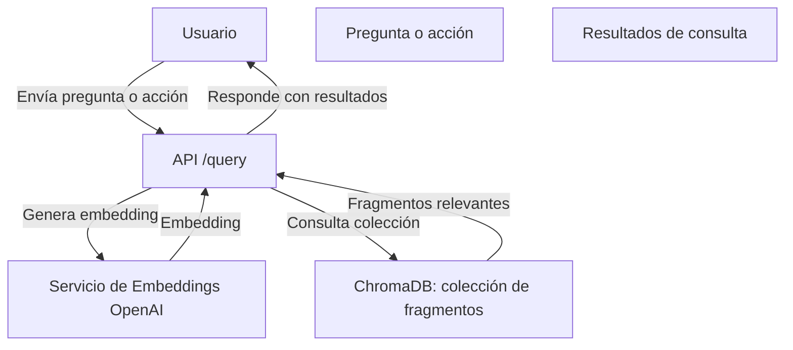

# Documentación Técnica: Rutas y Lógica de Consultas (`routes/query.js` y servicios asociados)

Este documento describe el funcionamiento de las rutas y la lógica asociada a las consultas semánticas y la gestión de colecciones en el sistema **RAGInternos**.

---

## Tabla de Contenidos

- [Propósito General](#propósito-general)
- [Endpoints Principales](#endpoints-principales)
  - [POST `/query/`](#post-query)
  - [GET `/query/documentos`](#get-querydocumentos)
  - [GET `/query/documentos-inactivos`](#get-querydocumentos-inactivos)
  - [POST `/query/reiniciar-coleccion`](#post-queryreiniciar-coleccion)
  - [POST `/query/marcar-inactivos`](#post-querymarcar-inactivos)
- [Lógica de Procesamiento](#lógica-de-procesamiento)
- [Ejemplo de Uso](#ejemplo-de-uso)
- [Consideraciones](#consideraciones)

---

## Propósito General

El módulo de consultas permite realizar búsquedas semánticas sobre los documentos almacenados, listar fragmentos activos e inactivos de la colección principal, reiniciar la colección y marcar fragmentos como inactivos. Utiliza embeddings para encontrar los fragmentos más relevantes a una pregunta y gestiona la colección principal en ChromaDB.



---
[Volver a la tabla de contenidos](#tabla-de-contenidos)

## Endpoints Principales

### POST `/query/`

- **Descripción:**  
  Recibe una pregunta, genera su embedding y consulta los fragmentos más relevantes en ChromaDB.
- **Parámetros:**  
  - `pregunta` (string, requerido): Pregunta del usuario.
  - `n` (opcional): Número de resultados a devolver.
- **Flujo:**
  1. Valida que exista la pregunta.
  2. Genera el embedding usando OpenAI.
  3. Busca el `collectionId` de la colección principal.
  4. Realiza la consulta semántica en ChromaDB.
  5. Devuelve los resultados relevantes.

---

### GET `/query/documentos`

- **Descripción:**  
  Lista todos los fragmentos/documentos activos de la colección principal.
- **Flujo:**
  1. Obtiene el `collectionId` de la colección.
  2. Recupera todos los documentos/fragments.
  3. Filtra y devuelve solo aquellos cuyo metadato `status` **NO** es `'inactivo'`.

---

### GET `/query/documentos-inactivos`

- **Descripción:**  
  Lista todos los fragmentos/documentos marcados como inactivos en la colección principal.
- **Flujo:**
  1. Obtiene el `collectionId` de la colección.
  2. Recupera todos los documentos/fragments.
  3. Filtra y devuelve solo aquellos cuyo metadato `status` **SÍ** es `'inactivo'`.

---

### POST `/query/reiniciar-coleccion`

- **Descripción:**  
  Elimina y vuelve a crear la colección principal en ChromaDB.
- **Flujo:**
  1. Busca el `collectionId`.
  2. Si existe, la elimina.
  3. Espera un breve tiempo para asegurar el borrado.
  4. Crea la colección nuevamente si no existe.
  5. Devuelve mensaje de éxito o error.

---

### POST `/query/marcar-inactivos`

- **Descripción:**  
  Marca como inactivos todos los fragmentos de una colección específica en ChromaDB.
- **Parámetros:**  
  - `collectionId` (string, requerido): ID de la colección a modificar.
- **Flujo:**
  1. Valida que se reciba el `collectionId`.
  2. Recupera todos los fragmentos de la colección.
  3. Actualiza el campo `status` de los metadatos a `'inactivo'` para todos.
  4. Sobrescribe los fragmentos en ChromaDB con los metadatos actualizados.
  5. Devuelve mensaje de éxito o error.

---

[Volver a la tabla de contenidos](#tabla-de-contenidos)

## Lógica de Procesamiento

- **Generación de Embeddings:**  
  Utiliza el modelo `text-embedding-3-small` de OpenAI para convertir preguntas en vectores semánticos.
- **Consulta Semántica:**  
  Busca los fragmentos más relevantes en ChromaDB usando el embedding generado.
- **Filtrado de Resultados:**  
  Solo se devuelven fragmentos activos, a menos que se consulte explícitamente por inactivos.
- **Gestión de Colecciones:**  
  Permite reiniciar la colección y marcar fragmentos como inactivos para mantener la integridad y relevancia de los datos.

[Volver a la tabla de contenidos](#tabla-de-contenidos)

---

## Ejemplo de Uso

### Consulta semántica

```bash
curl -X POST http://localhost:3000/query/ -H "Content-Type: application/json" -d '{"pregunta":"¿Cuál es la política de vacaciones?"}'
```

### Listar documentos activos

```bash
curl http://localhost:3000/query/documentos
```

### Listar documentos inactivos

```bash
curl http://localhost:3000/query/documentos-inactivos
```

### Reiniciar la colección

```bash
curl -X POST http://localhost:3000/query/reiniciar-coleccion
```

### Marcar fragmentos como inactivos

```bash
curl -X POST http://localhost:3000/query/marcar-inactivos -H "Content-Type: application/json" -d '{"collectionId":"<ID_DE_LA_COLECCION>"}'
```

[Volver a la tabla de contenidos](#tabla-de-contenidos)

---

## Consideraciones

- Se valida la existencia de parámetros requeridos en los endpoints.
- Se filtran los fragmentos inactivos en las respuestas para evitar exponer información no relevante.
- Se maneja el control de errores y se devuelven mensajes claros al cliente.
- El reinicio de la colección espera un breve tiempo para evitar condiciones de carrera.

[Volver a la tabla de contenidos](#tabla-de-contenidos)

---

> _Mantén este documento actualizado si cambian los endpoints o la lógica de consultas._