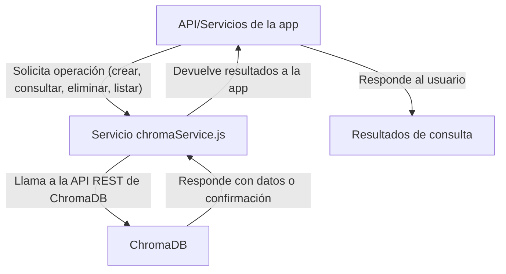

# Documentación Técnica: Servicio de ChromaDB (`services/rag/chromaService.js`)

Este documento describe el funcionamiento y la lógica asociada al servicio de integración con ChromaDB en el sistema **RAGInternos**.

---

## Tabla de Contenidos

- [Propósito General](#propósito-general)
- [Funciones Principales](#funciones-principales)
  - [getCollectionIdByName(nombreColeccion)](#getcollectionidbyname-nombrecoleccion)
  - [createCollection(nombreColeccion)](#createcollection-nombrecoleccion)
  - [addToCollection(collectionId, ids, embeddings, metadatas, documents)](#addtocollection-collectionid-ids-embeddings-metadatas-documents)
  - [queryCollection(collectionId, queryEmbedding, n = 3)](#querycollection-collectionid-queryembedding-n--3)
  - [listDocumentsInCollection(collectionId)](#listdocumentsincollection-collectionid)
  - [deleteCollection(collectionId)](#deletecollection-collectionid)
- [Consideraciones](#consideraciones)
- [Ejemplo de Uso](#ejemplo-de-uso)

---

## Propósito General

El servicio `chromaService.js` centraliza la lógica para interactuar con ChromaDB, la base de datos vectorial utilizada para almacenar y consultar embeddings y metadatos de fragmentos de documentos. Permite crear, consultar, listar, actualizar y eliminar colecciones y fragmentos, facilitando la búsqueda semántica y la gestión eficiente de los datos vectoriales.




---
[Volver a la tabla de contenidos](#tabla-de-contenidos)

## Funciones Principales


### `getCollectionIdByName(nombreColeccion)`

- **Descripción:**  
  Obtiene el identificador único (`collectionId`) de una colección en ChromaDB a partir de su nombre.
- **Uso típico:**  
  Antes de agregar, consultar o eliminar fragmentos, se necesita el `collectionId`.

---

### `createCollection(nombreColeccion)`

- **Descripción:**  
  Crea una nueva colección en ChromaDB con el nombre especificado.
- **Uso típico:**  
  Inicialización del sistema o cuando se requiere una nueva colección para almacenar embeddings.

---

### `addToCollection(collectionId, ids, embeddings, metadatas, documents)`

- **Descripción:**  
  Agrega o actualiza fragmentos (con sus embeddings y metadatos) en una colección existente.
- **Parámetros:**  
  - `collectionId`: ID de la colección destino.
  - `ids`: Array de identificadores de fragmentos.
  - `embeddings`: Array de vectores de embeddings.
  - `metadatas`: Array de objetos con metadatos de cada fragmento.
  - `documents`: Array de textos originales de los fragmentos.
- **Uso típico:**  
  Al procesar un PDF y generar sus embeddings, se almacenan aquí.

---

### `queryCollection(collectionId, queryEmbedding, n = 3)`

- **Descripción:**  
  Consulta la colección para obtener los `n` fragmentos más relevantes respecto a un embedding de consulta.
- **Parámetros:**  
  - `collectionId`: ID de la colección a consultar.
  - `queryEmbedding`: Vector de embedding de la consulta.
  - `n`: Número de resultados a devolver (por defecto 3).
- **Uso típico:**  
  Para búsquedas semánticas a partir de una pregunta del usuario.

---

### `listDocumentsInCollection(collectionId)`

- **Descripción:**  
  Lista todos los fragmentos/documentos almacenados en una colección específica.
- **Parámetros:**  
  - `collectionId`: ID de la colección a listar.
- **Uso típico:**  
  Para mostrar todos los fragmentos activos/inactivos o para operaciones de mantenimiento.

---

### `deleteCollection(collectionId)`

- **Descripción:**  
  Elimina una colección completa de ChromaDB.
- **Parámetros:**  
  - `collectionId`: ID de la colección a eliminar.
- **Uso típico:**  
  Para reiniciar el sistema o limpiar datos antiguos.

---

[Volver a la tabla de contenidos](#tabla-de-contenidos)

## Consideraciones

- Todas las funciones utilizan llamadas HTTP a la API REST de ChromaDB.
- El servicio maneja la serialización/deserialización de datos y la gestión de errores.
- Es fundamental para la integración de la búsqueda semántica y la administración de fragmentos vectoriales.
- Se recomienda validar la existencia de la colección antes de operar sobre ella.

[Volver a la tabla de contenidos](#tabla-de-contenidos)

---

## Ejemplo de Uso

### Crear una colección

```js
const collectionId = await createCollection('documentos_rag');
```

### Agregar fragmentos a una colección

```js
await addToCollection(collectionId, ids, embeddings, metadatas, documents);
```

### Consultar fragmentos relevantes

```js
const resultados = await queryCollection(collectionId, embeddingConsulta, 5);
```

### Listar todos los fragmentos

```js
const documentos = await listDocumentsInCollection(collectionId);
```

### Eliminar una colección

```js
await deleteCollection(collectionId);
```

[Volver a la tabla de contenidos](#tabla-de-contenidos)

---

> _Mantén este documento actualizado si cambian los endpoints, la lógica de integración o la estructura de ChromaDB._