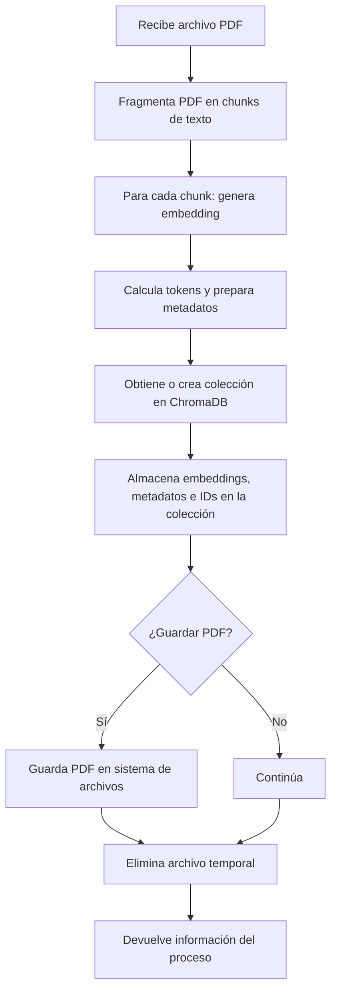

# Documentación Técnica: Servicio de Embeddings (`services/rag/embeddingService.js`)

Este documento describe el funcionamiento y la lógica asociada al servicio de procesamiento y almacenamiento de embeddings en el sistema **RAGInternos**.

---

## Tabla de Contenidos

- [Propósito General](#propósito-general)
- [Funciones Principales](#funciones-principales)
  - [createEmbedding(file)](#createembeddingfile)
  - [generateUniqueAlphanumericFileName(originalFileName)](#generateuniquealphanumericfilenameoriginalfilename)
- [Flujo de Procesos](#flujo-de-procesos)
- [Consideraciones](#consideraciones)
- [Ejemplo de Uso](#ejemplo-de-uso)

---

## Propósito General

El servicio `embeddingService.js` se encarga de procesar archivos PDF subidos por los usuarios, fragmentarlos en chunks de texto, generar embeddings para cada fragmento, calcular tokens, preparar metadatos y almacenar toda esta información en ChromaDB. Además, gestiona el almacenamiento temporal y la limpieza de archivos.

[Volver a la tabla de contenidos](#tabla-de-contenidos)

---

## Funciones Principales

### `createEmbedding(file)`

- **Descripción:**  
  Procesa un archivo PDF, lo fragmenta, genera embeddings para cada fragmento y almacena los resultados en ChromaDB.
- **Parámetros:**  
  - `file`: Objeto de archivo recibido (por ejemplo, de multer).
- **Flujo:**
  1. Fragmenta el PDF en chunks de texto.
  2. Para cada chunk:
     - Genera el embedding usando el modelo configurado.
     - Calcula la cantidad de tokens.
     - Prepara los metadatos asociados.
  3. Obtiene o crea la colección correspondiente en ChromaDB.
  4. Almacena los embeddings, metadatos e identificadores en la colección.
  5. (Opcional) Guarda el archivo PDF en el sistema de archivos.
  6. Elimina el archivo temporal.
  7. Devuelve información sobre el proceso.

---

### `generateUniqueAlphanumericFileName(originalFileName)`

- **Descripción:**  
  Genera un nombre de archivo único y aleatorio, manteniendo la extensión original.
- **Parámetros:**  
  - `originalFileName`: Nombre original del archivo.
- **Uso típico:**  
  Evitar colisiones de nombres al guardar archivos PDF subidos.

---

[Volver a la tabla de contenidos](#tabla-de-contenidos)

## Flujo de Procesos



[Volver a la tabla de contenidos](#tabla-de-contenidos)

---

## Consideraciones

- El proceso puede ser intensivo para archivos grandes.
- Se recomienda usar operaciones asíncronas para el manejo de archivos.
- Los archivos temporales se eliminan al finalizar el proceso.
- El endpoint espera archivos PDF y rechaza otros formatos.
- El sistema está preparado para integrarse con distintos modelos de embeddings.
- Los errores durante el procesamiento se manejan y devuelven con mensajes claros.

[Volver a la tabla de contenidos](#tabla-de-contenidos)

---

## Ejemplo de Uso

### Subida de PDF y generación de embeddings

```bash
curl -F "pdf=@/ruta/al/archivo.pdf" http://localhost:3000/embed/
```

### Respuesta esperada

```json
{
  "totalChunks": "12",
  "totalTokens": 3456,
  "newFileName": "uuid_o_nombre_coleccion"
}
```

[Volver a la tabla de contenidos](#tabla-de-contenidos)

---

> _Mantén este documento actualizado si cambian los endpoints o la lógica de embeddings._